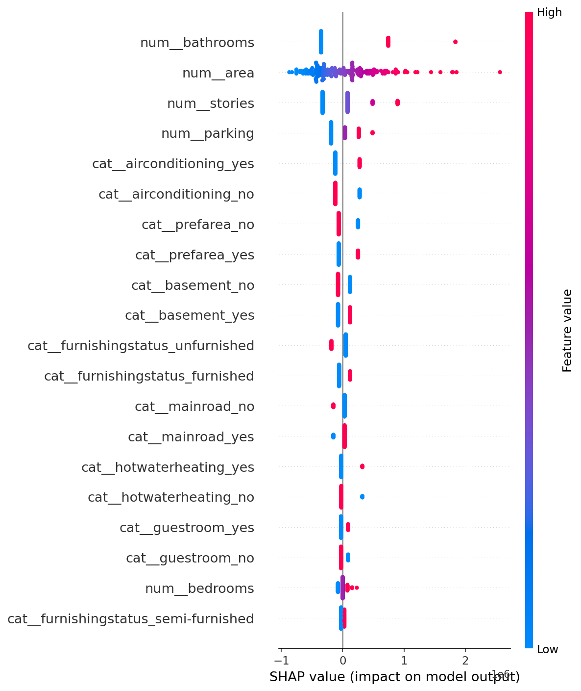
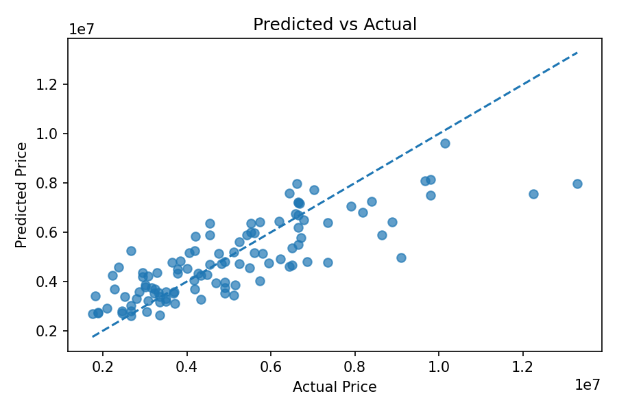
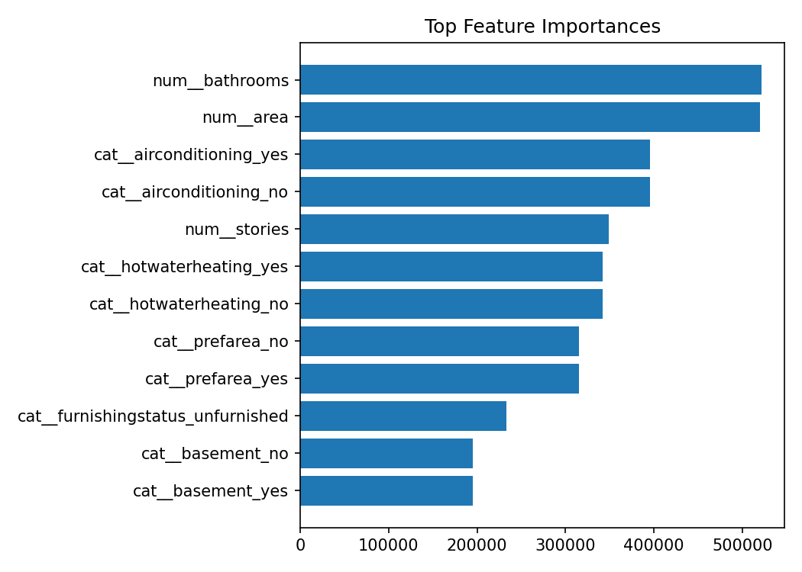

# House Price Prediction - End-to-End ML Project

[](https://your-app-name.streamlit.app)

A production-style machine learning project that predicts house prices from structured property features.  
This repository includes data validation, reproducible training, model benchmarking, explainability artifacts, a Streamlit app, and CI-ready tests.

## Key Outcomes
- Built and compared 3 regression models on a 545-row housing dataset.
- Best model from current run: **Linear Regression** (selected by lowest test RMSE).
- Final test metrics:
- RMSE: **1,324,506.96**
- MAE: **970,043.40**
- R2: **0.6529**
- Approximate 95% prediction range: **+- 2,580,201.74**
- Baseline linear model outperformed tuned tree ensembles in this dataset split:
- ~5.9% better RMSE than Random Forest
- ~5.3% better RMSE than Gradient Boosting

## Problem Statement
Given property attributes such as area, bedrooms, bathrooms, stories, parking, location preferences, and furnishing status, predict the house sale price as a regression task.

## Tech Stack
- Python, Pandas, NumPy, scikit-learn
- Pandera for schema validation
- MLflow (local tracking)
- SHAP + matplotlib for explainability and plots
- Streamlit for web app UI
- Pytest + Ruff + GitHub Actions for quality and CI

## Project Highlights
- Config-driven, reproducible training (`configs/train.yaml`)
- Strict train/inference schema checks via Pandera
- Preprocessing + model packed into a single inference pipeline
- Hyperparameter search (`RandomizedSearchCV`) for ensemble models
- Artifact contract for model, metrics, leaderboard, plots, and model card
- CLI interfaces for training and prediction
- Streamlit app with:
- explicit feature inputs
- model diagnostics in sidebar
- prediction range context
- per-prediction driver visualization

## Repository Structure
- `src/`: training, inference, validation, modeling, evaluation, explainability
- `app/`: Streamlit app entrypoint
- `tests/`: unit/inference tests
- `configs/`: YAML training config
- `artifacts/`: generated outputs (model, metrics, plots, model card)
- `.github/workflows/ci.yml`: CI workflow

## Model Benchmark (Current Run)
| Model | RMSE | MAE | R2 |
|---|---:|---:|---:|
| Linear Regression | 1,324,506.96 | 970,043.40 | 0.6529 |
| Random Forest (tuned) | 1,407,423.07 | 1,043,336.48 | 0.6081 |
| Gradient Boosting (tuned) | 1,399,107.11 | 1,027,903.62 | 0.6127 |

Source: `artifacts/leaderboard.json` and `artifacts/metrics.json`.

## Run Locally
```bash
pip install -r requirements.txt
python -m src.train --config configs/train.yaml
python -m src.predict --input sample_input.json --model-path artifacts/model.joblib
streamlit run app/streamlit_app.py
```

## Artifacts Produced
- `artifacts/model.joblib`
- `artifacts/preprocessor.joblib`
- `artifacts/metrics.json`
- `artifacts/leaderboard.json`
- `artifacts/model_card.md`
- `artifacts/plots/predicted_vs_actual.png`
- `artifacts/plots/residuals.png`
- `artifacts/plots/feature_importance.png`
- `artifacts/plots/shap_summary.png`

## Screenshots




## Testing and CI
```bash
ruff check src app tests
pytest -q
```

CI pipeline: `.github/workflows/ci.yml`